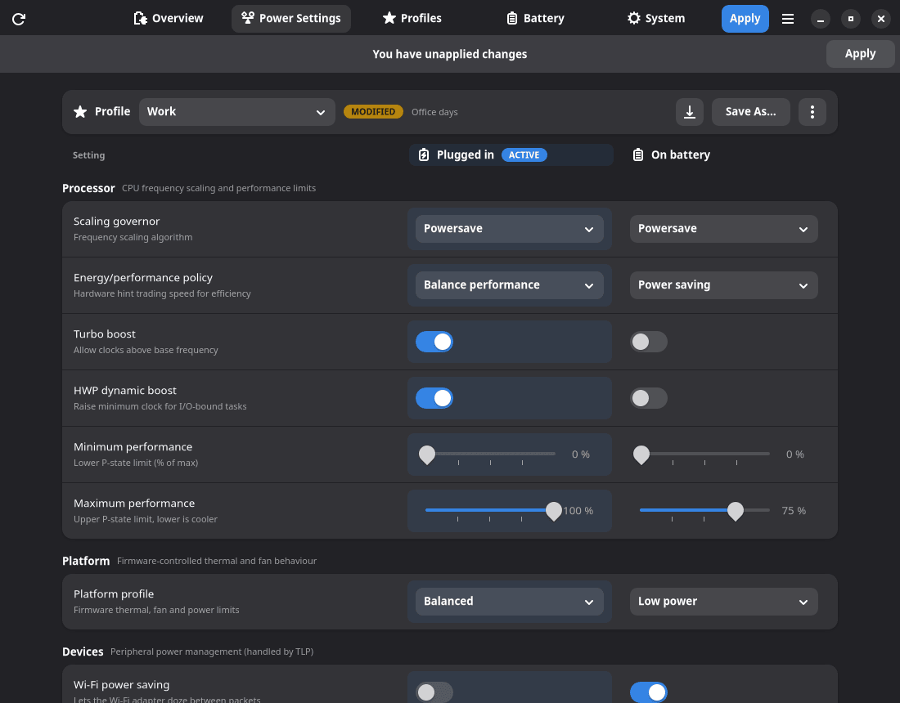
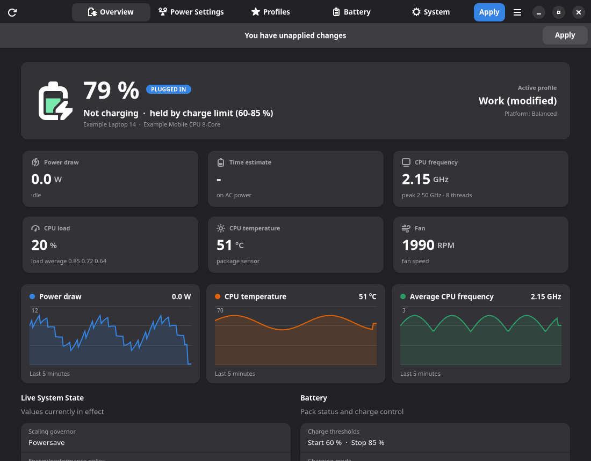
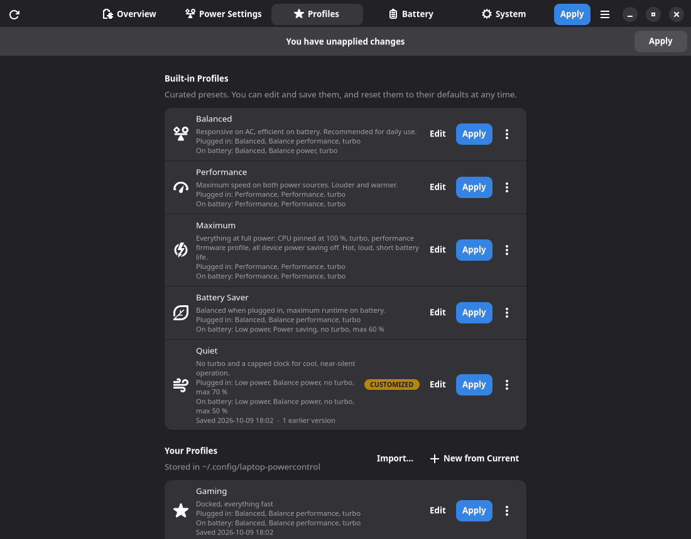
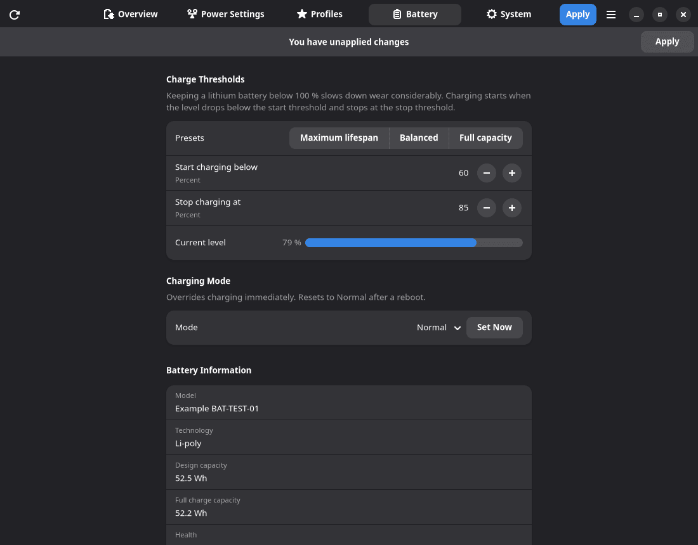

# Laptop Power Control

A GTK 4 / libadwaita app for tuning Linux laptop power settings separately for **plugged in** and
**on battery**. It sits on top of [TLP](https://linrunner.de/tlp/), so whatever you set keeps working
after a reboot and switches automatically when you plug in or unplug.



## What it does

- Two-column editor for CPU governor, energy/performance policy, turbo, min/max CPU performance,
  ACPI platform profile, Wi-Fi power saving, PCIe ASPM, runtime PM and audio power saving
- Built-in profiles (Balanced, Performance, Maximum, Battery Saver, Quiet) and your own profiles,
  with version history, revert, reset and import/export
- Battery charge thresholds and charging mode (inhibit charge, force discharge)
- Live overview: battery state, power draw, CPU frequency, load, temperature, fan
- Detects lines in `/etc/tlp.conf` that would silently override your settings and disables them
  (with a backup)

Only settings your hardware supports are shown.

**Linux only.** The app relies on TLP, sysfs and polkit, which do not exist on Windows or macOS.

| Overview | Profiles | Battery |
|---|---|---|
|  |  |  |

Light mode versions are in [docs/screenshots/light](docs/screenshots/light). The screenshots are rendered by CI from
a simulated test machine and refreshed automatically whenever the version number changes.

## Requirements

| | Fedora / RHEL | Debian / Ubuntu | Arch |
|---|---|---|---|
| Python 3.9+ | `python3` | `python3` | `python` |
| PyGObject with cairo | `python3-gobject` | `python3-gi` `python3-gi-cairo` | `python-gobject` |
| GTK 4.10+ | `gtk4` | `gir1.2-gtk-4.0` | `gtk4` |
| libadwaita 1.5+ | `libadwaita` | `gir1.2-adw-1` | `libadwaita` |
| polkit (`pkexec`) | `polkit` | `pkexec` | `polkit` |
| TLP (recommended) | `tlp` | `tlp` | `tlp` |

```bash
sudo dnf install python3-gobject gtk4 libadwaita polkit tlp                              # Fedora / RHEL
sudo apt install python3-gi python3-gi-cairo gir1.2-gtk-4.0 gir1.2-adw-1 pkexec tlp     # Debian 13+, Ubuntu 24.04+
sudo pacman -S python-gobject gtk4 libadwaita polkit tlp                                 # Arch
sudo systemctl enable --now tlp
```

There are no other Python dependencies. Make sure no other power manager (power-profiles-daemon,
tuned, auto-cpufreq) runs at the same time as TLP.

## Install

Pick one:

- **Debian / Ubuntu:** download the `.deb` from the
  [releases](https://github.com/kenangueler/laptop-powercontrol/releases) and run
  `sudo apt install ./laptop-powercontrol_*_all.deb`. It pulls in the requirements above.
- **AppImage:** download it from the releases, `chmod +x` it and run it. It contains only the app, so
  the requirements above must be installed. It asks for your password on every Apply.
- **From source:**
  ```bash
  git clone https://github.com/kenangueler/laptop-powercontrol.git
  cd laptop-powercontrol
  sudo ./install.sh          # sudo ./install.sh --uninstall to remove it
  ```
  This installs to `/usr/local` with a `powercontrol` command, a menu entry and a polkit policy, so you
  only authenticate once per session. You can also just run `./powercontrol.py` from the checkout.

## Usage

Pick or tweak a profile on the **Power Settings** page and press **Apply**. The column for your current
power source is highlighted.

From a terminal:

```bash
powercontrol --status
powercontrol --list-profiles
powercontrol --profile "Battery Saver"
powercontrol --reset-profile Balanced
```

Profiles are stored in `~/.config/laptop-powercontrol/`. The settings are written to
`/etc/tlp.d/99-powercontrol.conf`. To undo everything the app changed on the system, use
**System > Remove generated configuration**.

## Development

```bash
python3 -m unittest discover -s tests       # no root, no display needed
tests/run_gui_tests.sh                      # headless GUI test (needs mutter)
scripts/screenshots.sh                      # re-render docs/screenshots in a container
scripts/build-release.sh                    # build the tarball, .deb and AppImage into dist/
```

All tests run against a fake sysfs tree and never touch the real system. Pushing a `release/X.Y.Z` tag builds
and publishes a release. See [AGENTS.md](AGENTS.md) for how the code is organised.

## License

MIT, see [LICENSE](LICENSE).
